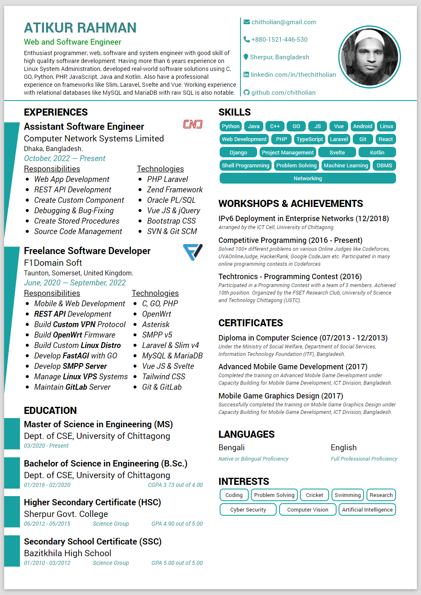

# Personal Resume Using HTML and CSS

I use this repository to build and version control my personal CV and resume.

The CV is created using HTML and CSS for more my own convenience and flexibility to design and improve.

It can be printed as PDF as it is rendered in the web browser.

## Preview

